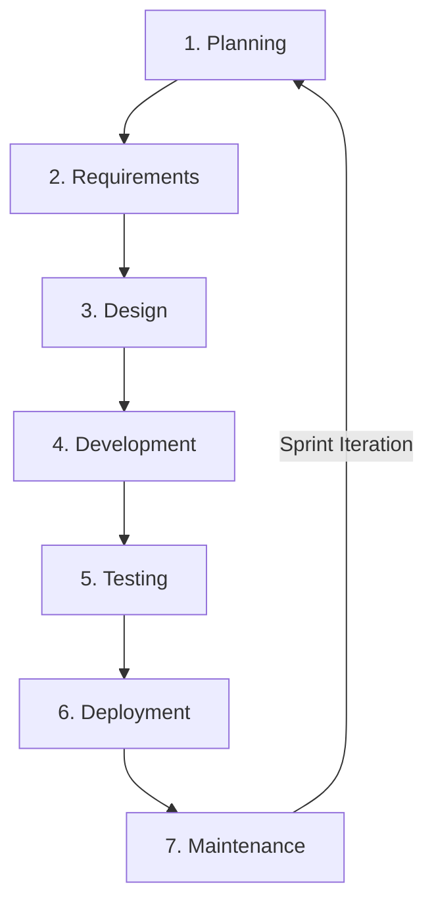

# Koperasi KADA All-in-one Financial Platform 💻📋

[](#)
[-blue.svg)](#)
[](https://www.utm.my/)

Welcome to the **Software Engineering Documentation Portfolio** for the Koperasi KADA All-in-one Financial Platform. This repository hosts all formal software engineering deliverables, requirements specifications, project proposals, and process modeling reports designed for the staff cooperative of **Lembaga Kemajuan Pertanian Kemubu (KADA)** Kelantan BHD.

---

## 📂 Repository Structure

```
Software-Engineering/
├── assignments/
│   └── SE._Assignment_1_-_Project_Proposal.pdf   # Project Proposal Report (NABC Analysis)
├── system-documentation/
│   ├── SDD_Techmedico.pdf                        # System Documentation (SD) (Software Engineering)
│   └── v1.0_SRS.pdf                              # Software Requirements Specification (SRS)
├── references/
│   ├── DB_P2-1.pdf                               # Conceptual Database Design Report (Database WBL)
│   └── SECP2523_AA_Report_Template_Phase1.pdf    # Alternative Assessment Report Phase 1 (Error Monitoring Module)
└── README.md                                     # Project guide and overview (This file)
```

---

## 💡 Project Proposal: NABC Analysis

Our team conducted a structured **NABC (Need, Approach, Benefit, Competition)** analysis to guide the conception of the Koperasi KADA Online Platform:

### 1. Need (N)
Traditional cooperative management in KADA relies on manual, paper-based workflows. Key problems include:
* **Lack of Integration**: No connection to accounting tools, causing data mismatches and manual calculation overhead.
* **Security Risks**: Personal and financial records stored on paper or unencrypted logs are vulnerable to data breaches.
* **Lack of Accessibility**: Rural members must physically visit the cooperative offices for simple transactions or account balance checks.
* **Static Engagement**: Members cannot monitor loan states or savings goals dynamically due to a lack of alerts or reminders.

### 2. Approach (A)
The proposed solution is a cloud-based web application providing a centralized dashboard:
* **Automated Member Registration**: Allows members to submit personal details and upload files online.
* **Smart Savings System**: Supports goal setting (e.g., targets, durations) and scheduled recurring deposits.
* **Built-in Loan Calculator**: Automatically computes monthly installments at a constant interest rate of **4.2%**.
* **Advanced Verification**: Integrates document auto-validation, role-based access controls, and secure login via WhatsApp OTP.

### 3. Benefits (B)
* **Administrative Efficiency**: Reduces office visit congestion and manual processing delays.
* **Enhanced Transparency**: Real-time account balances, deposit logs, and payment histories visible in the dashboard.
* **Security & Inclusivity**: Complies with Malaysia's **PDPA 2010** regulations using AES-256 encryption, while supporting screen readers and multi-language controls.

### 4. Competitors (C)
Compared to commercial e-wallets (Touch 'n Go, Boost) and standard credit union management platforms (CUMIS):
* **Tailored Features**: General e-wallets lack custom loan application workflows or cooperative policy constraints.
* **Flexible Scope**: Platforms like CUMIS focus solely on regulatory financial transactions, failing to offer interactive communication portals. KADA's system provides localized support (Malay language, custom bank integrations) and a user-assistance chatbot.

---

## 🔄 Software Process Model: Agile SDLC

The project is governed by the **Agile Software Development Model** to promote iteration, adaptation, and continuous stakeholder feedback. The Software Development Life Cycle (SDLC) activities are structured as follows:



### 1. Planning
* Define project scope, deliverables, timelines, and budgets.
* Perform technical, operational, and financial feasibility analyses.
* Outline team roles and assign modules.
* Establish project risk management protocols.

### 2. Requirements
* Draft functional and non-functional requirements.
* Conduct joint requirements workshops with KADA stakeholders.
* Formulate detailed user stories and define clear Acceptance Criteria.
* Secure stakeholder sign-off on requirements.

### 3. Design
* Model system architecture and design the relational database schema.
* Generate UI wireframes, screen mockups, and early interactive prototypes.
* Design safety features (e.g., authentication tokens, AES-256 encryption rules).

### 4. Development
* Implement backend business logic and rest APIs.
* Design responsive frontend UI components.
* Build third-party integrations (payment gateways, WhatsApp OTP API).
* Perform unit testing and pair code reviews.

### 5. Testing
* Draft test cases and scripts for validation.
* Conduct unit testing, system testing, and integration testing.
* Organize User Acceptance Testing (UAT) sessions with KADA staff.
* Manage, log, and resolve defects.

### 6. Deployment
* Set up staging and cloud staging environments.
* Run load and performance tests in staging.
* Deploy stable builds to the production environment.

### 7. Maintenance
* Monitor system logs and check error trends.
* Apply security patches and updates.
* Run daily scheduled backups and test data recovery procedures.

---

## 👥 Project Team & Capabilities

The project documentation and planning deliverables were developed by the following team members:

| Member Name | Matric No. | Role & Module Responsibilities |
| :--- | :---: | :--- |
| **Lau Yan Kai** (Team Leader) | A23CS0098 | Developer: Board of Directors & Staff Modules |
| **Ng Yu Hin** | A23CS0148 | Developer: Member & Loan Management Modules |
| **Chew Chiu Xian** | A23CS0061 | Developer: Member & Savings Modules |
| **Evelyn Goh Yuan Qi** | A23CS0222 | Developer: User Authentication & Registration Modules |
| **Dheshighan A/L Saravana Moorthy** | A23CS0072 | Developer: User Authentication & Login Modules |
